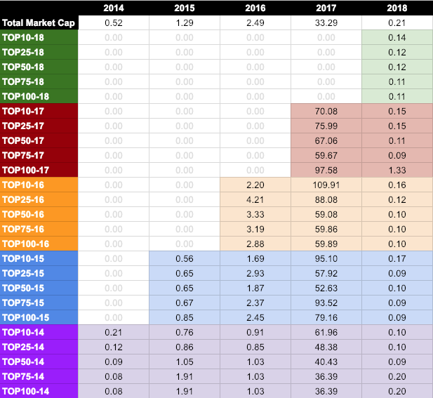

# Crypto Tops

This is a weekend project to study the evolution of top cryptocurrency prices.

The study consists on:

* There is source of information that allows us to order cryptocurrencies based on their total market value. This source is coinmarketcap.com
* By the beginning of the year (1st Janurary), we buy the TOP10, TOP25, TOP50, TOP75 and TOP100 cryptocurrencies, using the same amount of money for each one.
* Each TOP of a certain year represents an index. For example, the index called TOP10-17 consists of the 10 cryptocurrencies with higher market capitalization by the beginning of 2017.
* We want to know how much has increased/decreased the value of each index in a certain year thus, a ratio of the value change is calculated.



You can see the results in a [spreadsheet](https://docs.google.com/spreadsheets/d/1Q1xGWCn5dBpw6t9AXa29NvUZyX6zKuahUutpOYvUy9Y/edit?usp=sharing).


## How to reproduce the study


```bash
# Clone the repo
git clone git_address
cd project_directory

# Install and use the ruby version specified in .ruby-version
# Recommended libraries: chruby + ruby-install
# It should work with other ruby versions but it have not been tested

# Install bundler
gem install bundler

# Install project dependencies
bundle install

# Create development database schema
bundle exec rake db:setup

# Collect data from coinmarketcap to our database
bundle exec rake db:index

# Output the results
bundle exec rake results
```